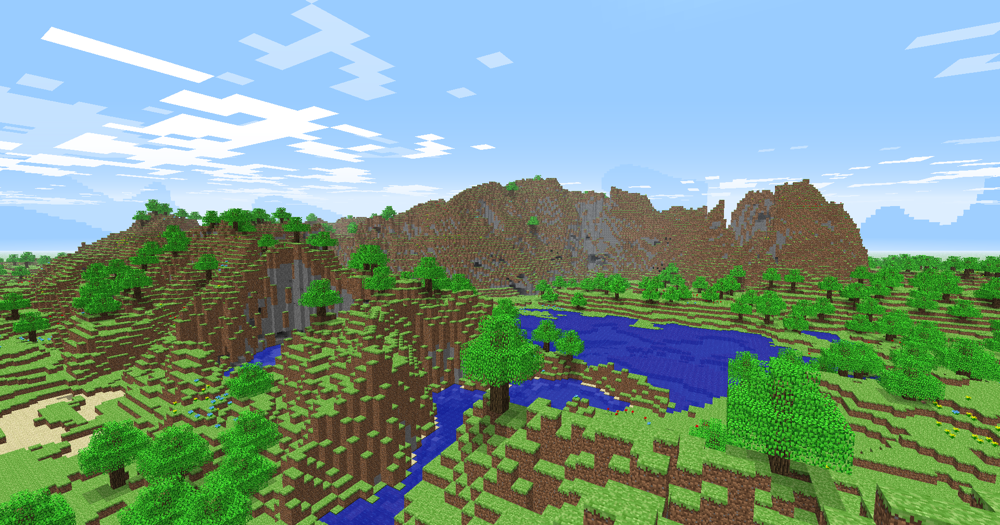
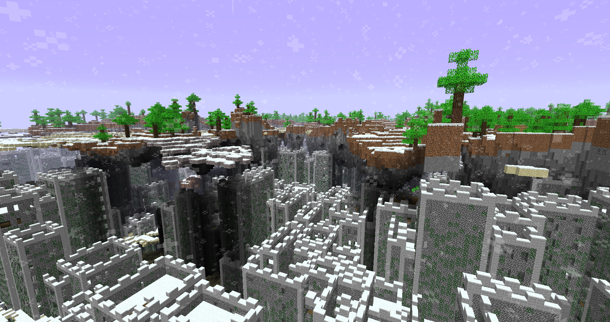
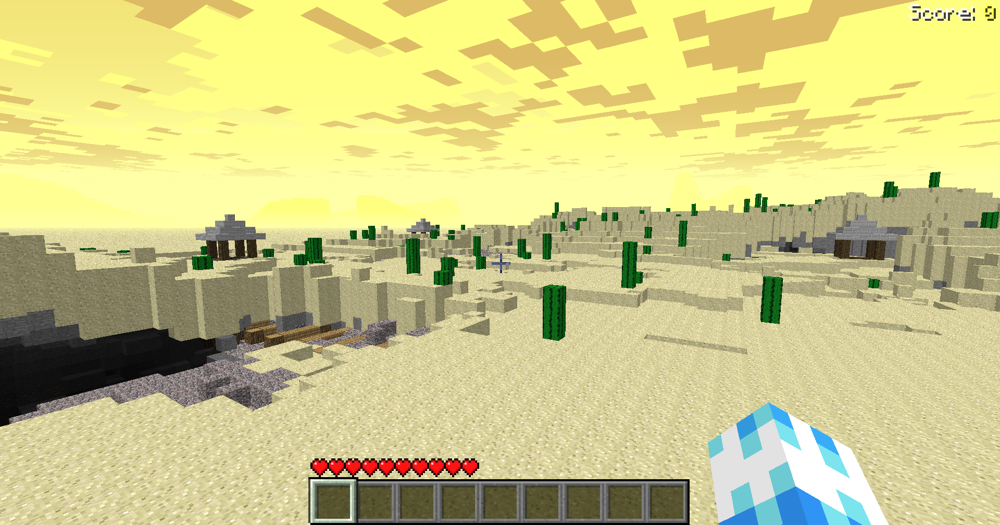
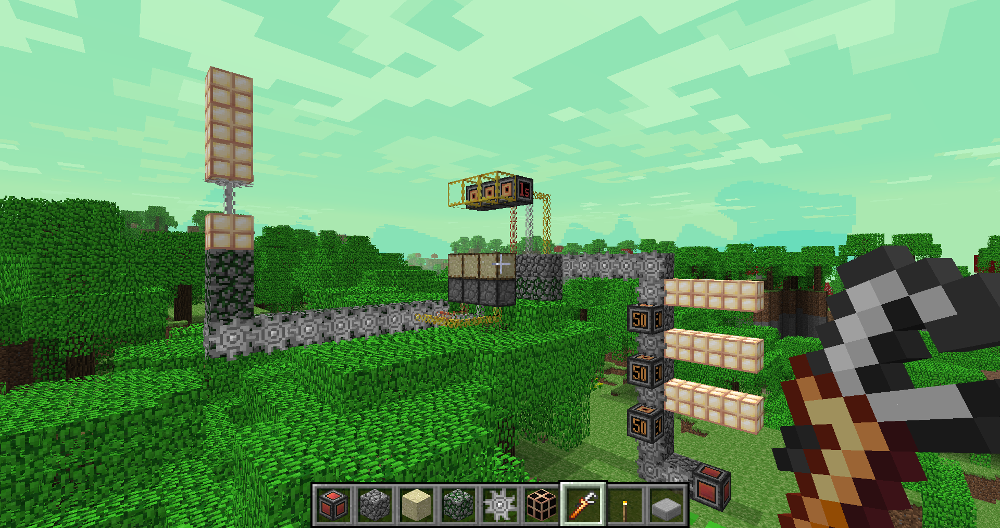
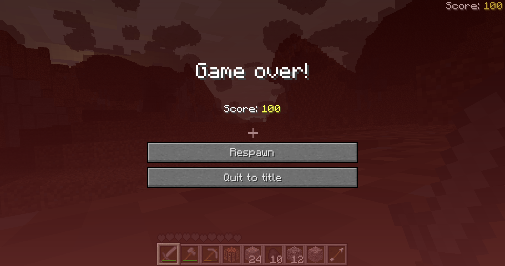

 

    

 

Indev Adventure is a mod for Indev 20100223 that adds in plenty of new level types, themes and structures, creative mode, functional gears, improved performance and more. This mod features the ability to enter new worlds by walking across the edges!

## Features
- 15 level types, 13 level themes and 3 structures alongside a broader range of level sizes, bringing the total combinations from a measily 144 up to over 30000!
- Worlds: distinct from levels, when you walk between edges, you enter new levels! Basically Infdev while keeping the charm of finite worlds.
- Fully fledged creative mode with flying (another movement option is sneaking)
- Functional gears with plenty of mechanical blocks for you to create contraptions to your heart's desire (basically an alternative take on redstone which relies on pulses instead of stored state)
- Additional blocks and crafting recipes so you can finally build with dyed cloth and bricks in survival.
- Improved performance including improved lighting and ticking code to make extra large worlds more smooth.
- Quality of life features, ranging from tweaks to allow for renewability to a recipe guide to identify how to craft new blocks and items.

## Screenshots

